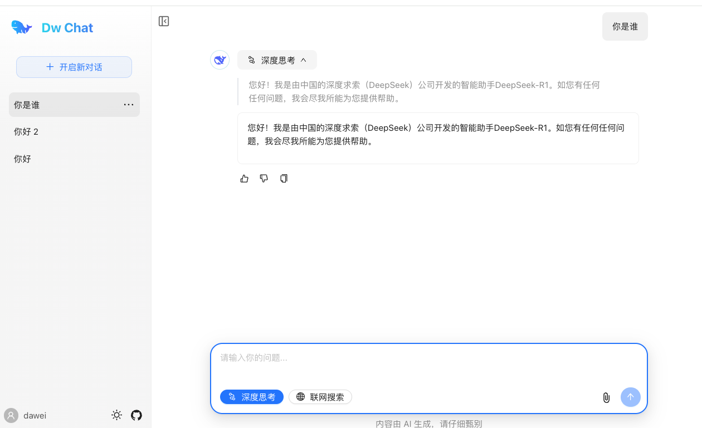

## Dw Chat

Dw Chat 后端工程

一个接入 DeepSeek-V3、DeepSeek-R1 大模型的极简 AI 对话页面.

演示地址：https://dw-chat.dw1898.top

效果图：

#### 主要技术：

1.DeepSeek-V3、DeepSeek-R1 LLM

2.Java 21

3.spring-boot 3.4

4.spring-ai-alibaba 1.0.0-M6.1

5.mysql

### 项目结构

dw-chat-web-lite：纯前端版工程     Github：https://github.com/dawei1898/dw-chat-web-lite

dw-chat-web：前端工程        Github：https://github.com/dawei1898/dw-chat-web

dw-chat：后端工程        Github：https://github.com/dawei1898/dw-chat

dw-chat-next：next 全栈版工程      Github：https://github.com/dawei1898/dw-chat-next
